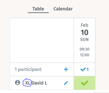

# Hockey 1.0

The Sport Event of the year

## When
Sunday 10th February 10:00 to 12:00

## Where
[Dolder](https://www.doldersports.com/en/winter-front-page-en/ice-skating-rink/ "Title") 

## Requisite
Full equipment is available at Dolder including skates, protection hockey stick etc. Just bring a towel and cash.

## Cost
75 CHF, final cost will depend on how many people show up, in case we have some money left it will be spent on beer and dental care

## How to register
Two ways exist

1. [Doodle](https://doodle.com/poll/ttvskx8gsmmtswzr "Title")
2. Merge request updating the list below

* David
* Adrian
* Benjamin
* Ueli 
* __Your name here__

Please add you equipment size before the name and a G if you want to be goalie. We need to tell Dolder how many sets we need no later than 5th Feb

## Deadline
Please register asap, no later than 31st Jan

## Communication
Whats's up group https://chat.whatsapp.com/KTdPAVc2USg84PP4k8hwUi

## Stuff in German

[Dolder Booking](Booking.pdf)
[Info](Plauschhockey 2018-19.pdf)

## FAQ

__Do I need to know how to play?__
Nope, actually we prefer if you're not too good

__Do I need to know how to skate?__
Nope, just focus on the physical part of the game or volunteer as goal tender

__Can I invite a friend__
Sure, ideally we should be around 20 including goal keepers

